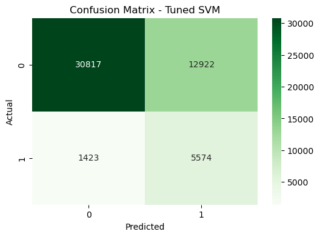
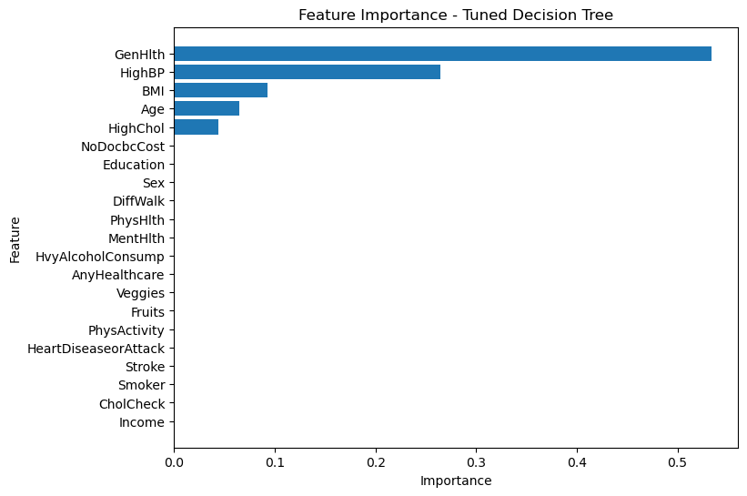

# 🩺 Diabetes Risk Prediction using Machine Learning

## Overview
This project builds and evaluates multiple machine learning models to predict diabetes risk using a large-scale public health dataset.

The focus is on improving early detection by prioritizing **recall**, ensuring that high-risk individuals are not missed while maintaining overall model performance.

## Key Results
- Best Model: **Support Vector Machine (SVM)**
- Recall (Diabetic Class): **0.80**
- Key Insight: Accuracy alone is misleading in imbalanced healthcare datasets

## Dataset
- Source: UCI Machine Learning Repository  
- Dataset: CDC Diabetes Health Indicators  
- Records: ~250,000+ survey responses  
- Features include:
  - BMI, Age, Income
  - High Blood Pressure, High Cholesterol
  - Physical Activity, Smoking
  - General Health Indicators

This dataset is significantly larger and more representative than commonly used diabetes datasets, enabling more robust modeling.

## Objective
- Build and compare multiple classification models for diabetes prediction  
- Handle class imbalance effectively  
- Ensure fair comparison using consistent evaluation metrics  
- Optimize models using hyperparameter tuning  
- Select a model that maximizes recall for high-risk individuals  

## Models Implemented
The following machine learning models were developed and evaluated:
* Logistic Regression
* K-Nearest Neighbors (KNN)
* Decision Tree
* Support Vector Machine (SVM)
* Ensemble Model (Soft Voting Classifier)

## Methodology

### 1. Data Preprocessing
* Train-test split using **stratified sampling** to preserve class distribution
* Feature scaling using **StandardScaler** for distance-based models

### 2. Baseline Modeling
* Initial models were built using default parameters
* Provided a benchmark for evaluating improvements

### 3. Hyperparameter Tuning
* Used **GridSearchCV** to optimize model performance
* Evaluation metric: **F1-score** (due to class imbalance)

### 4. Final Model Training
* Best hyperparameters were selected from GridSearchCV
* Models retrained on training data

### 5. Ensemble Model
* Built a **heterogeneous ensemble** combining:
  * Logistic Regression
  * KNN
  * SVM
  * Decision Tree
* Used **soft voting** to aggregate predicted probabilities

All models were evaluated using the same preprocessing pipeline and metrics to ensure consistency and fair comparison.

## Evaluation Metrics
Models were evaluated using:
* Accuracy
* Precision
* Recall
* F1-score
* ROC-AUC
* Confusion Matrix
Since the dataset is imbalanced, special emphasis was placed on **Recall and F1-score for the diabetic (minority) class**

## Model Performance

| Model               |Accuracy | ROC-AUC | Recall (Class 1) | Precision (Class 1) | F1 Score (Class 1) |
|---------------------|---------|---------|-------------------|---------------------|-------------------|
| Logistic Regression | 73%     | 0.826   | 0.77              | 0.31                | 0.44              |
| KNN                 | 83%     | 0.675   | 0.24              | 0.34                | 0.28              |
| Decision Tree       | 68%     | 0.808   | 0.81              | 0.28                | 0.41              |
| SVM                 | 72%     | 0.826   | 0.80              | 0.30                | 0.44              |
| Ensemble Model      | 83.1%   | 0.821   | 0.47              | 0.41                | 0.44              |

Class 1 represents diabetic patients. Recall is prioritized to minimize false negatives in medical diagnosis.

## 📊 Visualizations

### Confusion Matrix (SVM)

### Feature Importance (Tuned Decision Tree)

## Results Summary
- SVM achieved the best balance between **recall (0.80)** and overall model stability  
- KNN achieved the highest accuracy (83%) but failed to detect diabetic cases effectively (recall = 0.24)  
- Decision Tree maximized recall (0.81) but produced a high number of false positives  
- Ensemble model improved accuracy but did not improve recall sufficiently  

These results highlight the importance of selecting models based on problem context rather than accuracy alone.

## Final Model Selection
SVM was selected as the final model because:
- It achieved the best balance between recall and precision  
- Maintained strong performance across all evaluation metrics  
- Provided more stable generalization compared to other models  

This makes it more suitable for real-world healthcare scenarios where missing a positive case is costly.

## Key Insights
- Models sensitive to feature scaling (KNN, SVM) benefited significantly from standardization  
- Class imbalance negatively impacted distance-based models like KNN  
- Decision Trees tend to overfit, leading to higher recall but lower precision  
- Hyperparameter tuning significantly improved model performance across all models  
- Prioritizing recall is critical in healthcare applications to reduce false negatives
- Accuracy is not a reliable metric for imbalanced healthcare datasets, as demonstrated by KNN’s poor recall despite high accuracy

## Model Optimization & Contribution
- Applied GridSearchCV across all models for systematic tuning  
- Standardized evaluation metrics to ensure fair comparison across team models  
- Improved overall rigor and consistency in model evaluation  

This approach ensured that model performance comparisons were unbiased and reliable.

## Limitations
- Dataset is based on self-reported survey data  
- Potential class imbalance may affect predictions  
- Model is not clinically validated  
- External validation on real-world clinical data is required

## Technologies Used
* Python
* Scikit-learn
* Pandas
* NumPy
* Matplotlib

## Future Improvements
* Apply resampling techniques (SMOTE, undersampling)
* Experiment with weighted ensemble models
* Explore advanced models like XGBoost or LightGBM

